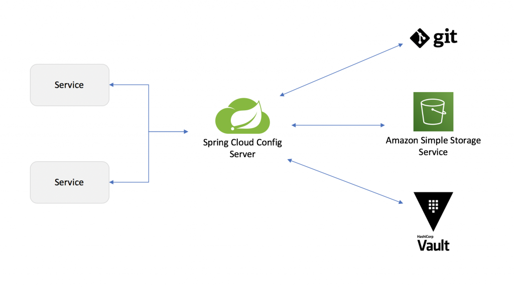

# Atelier Spring Config / Spring Vault

## Hashicorp Vault

### Documentation

>https://developer.hashicorp.com/vault/docs , https://hub.docker.com/r/hashicorp/vault 

>https://docs.spring.io/spring-cloud-config/docs/current/reference/html/

>https://docs.spring.io/spring-cloud-vault/docs/current/reference/html/

### Installation 

```sh
$ docker run --cap-add=IPC_LOCK  -d --name=dev-vault -p 8200:8200 hashicorp/vault
```

***

## Spring Config

Pour la creation des projets Spring passez par le site : https://start.spring.io/

Pour s'inspirer :
>https://github.com/hmakroum/ateliers/tree/dev/spring-config-vault/

### Architecture



### Config Server

>https://github.com/hmakroum/ateliers/tree/dev/spring-config-vault/server


### Config Client

>https://github.com/hmakroum/ateliers/tree/dev/spring-config-vault/client